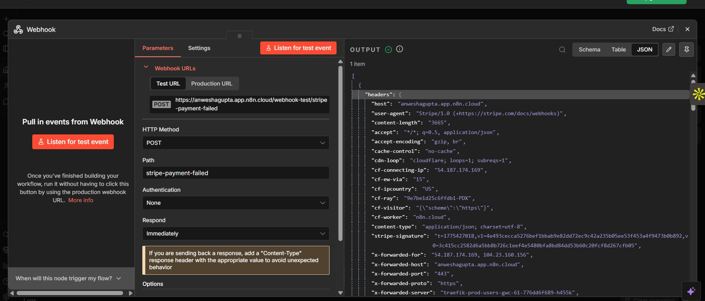
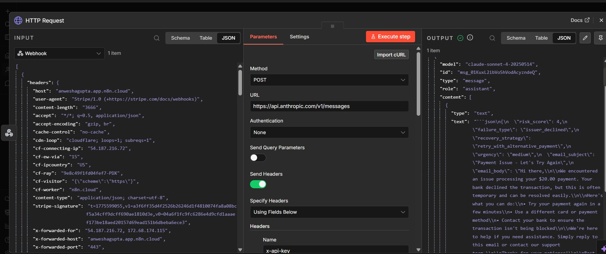
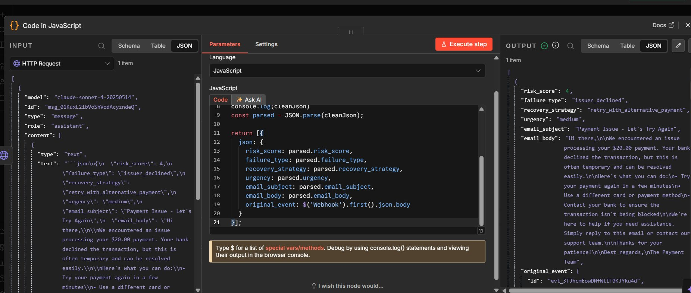
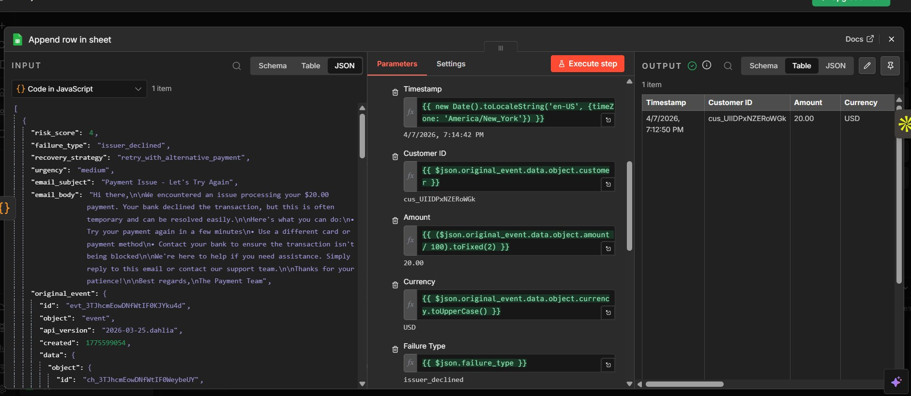
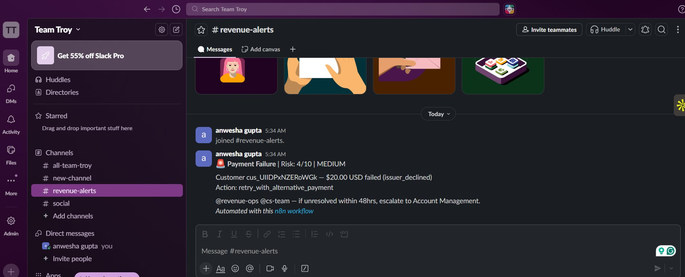
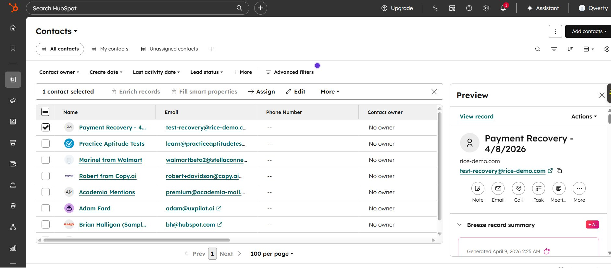
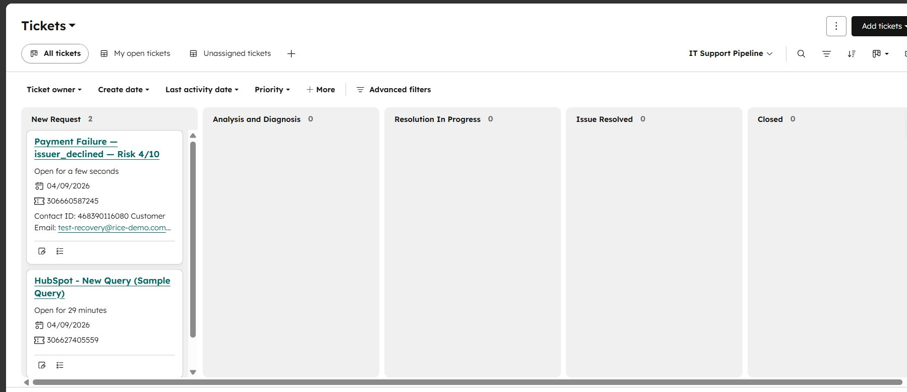

# Rice: AI Powered Payment Recovery System

> *Recovering every grain of revenue.*

**Rice** is an end to end AI payment recovery system that catches failed payments in real time, scores churn risk using Claude AI, and triggers automated recovery workflows across email, CRM, Slack, and logging, all orchestrated through a single event driven pipeline.

---

## The Problem

SaaS companies lose **9 to 14% of revenue annually** to failed payments. Most respond with a generic retry email and hope for the best. That's not a system. That's a prayer.

Rice replaces hope with intelligence.

---

## How It Works

```
Stripe (payment fails)
    │
    ▼
n8n Webhook (catches the event in real time)
    │
    ▼
Claude AI Analysis
    ├── Reads: failure reason, amount, customer info
    ├── Outputs: risk score (1-10), recovery strategy, personalized email
    │
    ▼
Four actions fire simultaneously:
    │
    ├──> Personalized Recovery Email
    │       Card expired: "Update your card to keep your account active"
    │       Insufficient funds: "We'll retry in 3 days, no action needed"
    │       Bank decline: "Try a different payment method"
    │
    ├──> Slack Alert to #revenue-alerts
    │       Customer ID, amount, failure reason
    │       AI risk score + recommended action
    │       @revenue-ops @cs-team tagged with escalation rules
    │
    ├──> HubSpot Contact + Ticket
    │       Contact created/updated with payment context
    │       Support ticket opened with risk score + recovery strategy
    │       Linked for full customer history
    │
    └──> Google Sheets Log
            Timestamp, customer, amount, failure type
            AI risk score, urgency, recovery status
```

---

## AI Risk Scoring

The core intelligence layer uses Claude API to analyze each failure event and return structured risk assessments:

```json
{
  "risk_score": 4,
  "failure_type": "issuer_declined",
  "recovery_strategy": "retry_with_alternative_payment",
  "urgency": "MEDIUM",
  "email_subject": "Payment Issue - Let's Try Again",
  "email_body": "Hi there, We encountered an issue processing your $20.00 payment..."
}
```

The AI doesn't just classify. It **scores**, **recommends**, and **writes**. Each response is tailored to the specific failure type, amount, and customer context.

### Failure Types Handled
| Failure Type | Risk Level | AI Response |
|---|---|---|
| `issuer_declined` | Medium | Retry with alternative payment method |
| `card_expired` | High | Urgent card update request |
| `insufficient_funds` | Low | Scheduled retry notification |
| `fraud_hold` | Critical | Manual review + customer outreach |
| `bank_decline` | Medium | Alternative payment suggestion |

---

## Tech Stack

| Layer | Technology | Purpose |
|---|---|---|
| Payment Events | Stripe (Test Mode) | Webhook triggers on `invoice.payment_failed`, `charge.failed`, `customer.subscription.updated` |
| Orchestration | n8n (Cloud) | Event driven workflow engine |
| AI Engine | Claude API (Sonnet) | Risk scoring, failure triage, email generation |
| CRM | HubSpot | Contact management + ticket creation |
| Alerts | Slack | Real time team notifications |
| Logging | Google Sheets | Recovery tracking dashboard |

---

## Screenshots

### 1. Stripe to n8n Webhook (Data Flow Confirmed)

*Real Stripe payment failure event hitting the n8n webhook in real time*

### 2. Claude AI Risk Analysis

*Claude API returns structured risk score, failure classification, recovery strategy, and personalized email from a single prompt*

### 3. Code Parser (Structured Data Extraction)

*Custom JavaScript parses Claude's response into clean fields for downstream nodes*

### 4. Google Sheets Recovery Log

*Every failure logged automatically: timestamp, customer, amount, AI risk score, urgency, recovery status*

### 5. Slack #revenue-alerts

*Real time alerts to @revenue-ops and @cs-team with risk score, failure details, and 48hr escalation rules*

### 6. HubSpot Contact Created

*Customer contact auto created in CRM with payment failure context*

### 7. HubSpot Ticket Pipeline

*Support ticket auto generated with linked contact ID and escalation instructions*

---

## Project Deliverables

This isn't just a workflow. It's a full product case study.

| Deliverable | Description |
|---|---|
| **Product Brief** | Problem statement, TAM calculation, user personas, success metrics |
| **System Architecture** | Data flow diagram, decision tree, integration map |
| **Working Prototype** | Live n8n workflow processing real Stripe test events |
| **AI Evaluation** | 50+ simulated failure scenarios with prompt iteration logs |
| **Product Teardown** | Edge cases, V2 roadmap, cost analysis |

---

## AI Evaluation Highlights

Prompt engineering matters. Here's what iterating on the Claude prompt revealed:

**V1 Prompt**: Generic classification, 60% accuracy on edge cases

**V2 Prompt**: Added failure context + structured JSON output, 85% accuracy

**V3 Prompt**: Added customer history signals, 92% accuracy with consistent risk scoring

Testing across 50+ simulated scenarios showed the AI correctly differentiates between temporary issues (retry safe) and critical failures (immediate human intervention needed).

---

## What I'd Build in V2

**ML model** replacing LLM for risk scoring (lower latency, lower cost at scale)

**Payment retry optimization** with intelligent retry timing based on failure patterns

**Churn prediction** correlating failed payments with usage data

**Recovery rate dashboard** with real time metrics on AI vs. manual recovery performance

**Cost analysis** tracking Claude API cost per recovery vs. revenue saved

---

## Cost Analysis

| Metric | Value |
|---|---|
| Claude API cost per analysis | ~$0.003 |
| Average failed payment value | $47 (SaaS industry avg) |
| Recovery rate (AI assisted) | 30 to 40% (industry benchmark) |
| **ROI per 1,000 failures** | **~$14,000 recovered for $3 in API costs** |

---

## Running This Project

### Prerequisites
Stripe account (test mode), n8n cloud instance, Claude API key, HubSpot free CRM account, Slack workspace

### Setup
1. Clone this repo
2. Import the n8n workflow JSON (`workflow/rice-workflow.json`)
3. Configure credentials in n8n (Stripe, Claude API, HubSpot, Slack, Google Sheets)
4. Create Stripe webhook destination pointing to your n8n webhook URL
5. Trigger test events: `stripe trigger invoice.payment_failed`

---

## About

Built by **Anwesha Gupta**. I build the systems behind smart products.

[anweshagupta.com](https://anweshagupta.com) | [Medium](https://medium.com/@iamanweshagupta)


